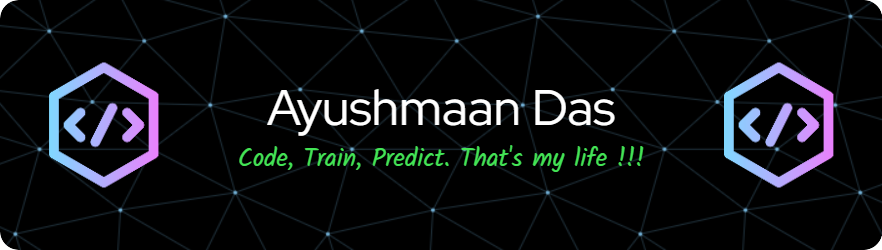

  

<!-- Intro -->

  <i>
  👋 Hello, I'm a passionate <strong>AI and Machine Learning Enthusiast</strong>, pursuing my undergraduate studies.  
  With a relentless drive for <strong>excellence</strong>, I've executed numerous projects across <strong>Machine Learning Engineering</strong> and <strong>Data Science</strong>.   
  I'm deeply involved in <strong>research publications</strong> and <strong>patent submissions</strong>, showcasing a steadfast commitment to <strong>innovation</strong>. 
  I thrive in <strong>team environments</strong> with solid coordination and communication skills.
  </i>
  

  

<!-- GitHub Streak -->

    
  

<!-- Badges: Programming Languages -->
### 🖥️ Programming Languages 

  
  
  
  
  
  

<!-- Machine Learning, DL & NLP -->
### 🤖 Machine Learning, Deep Learning and NLP

  
  
  
  
  
  
  

### 🌐 Web Frameworks

  
  
  
  
  
  

<!-- Database Technologies -->
### 💾 Database Technologies

  
  
  

<!-- Tools & Technologies -->
### 🛠️ Other Tools & Technologies

  
  
  
  
  
  
  
  
  

### 🧾Research Works and Book Chapters
<ul>
  <li><a href="https://www.taylorfrancis.com/chapters/edit/10.1201/9781032630212-14/streaming-highway-traffic-alerts-using-twitter-api-jayanthi-ganapathy-ramya-mohanakrishnan-ayushmaan-das-fausto-pedro-garcia-marque">Streaming Highway Traffic Alerts using Twitter API</a></li>
</ul>

